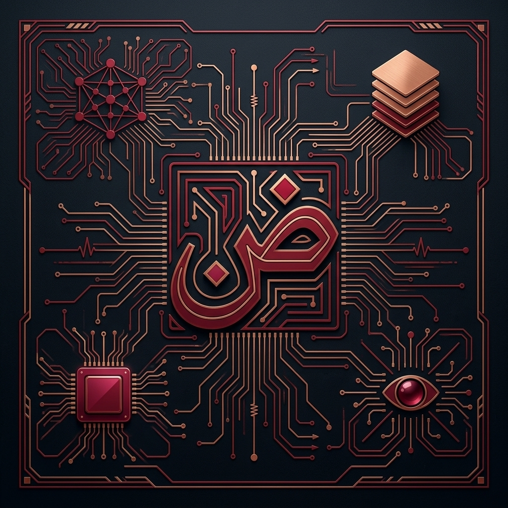

# Awesome-Arabic-LLM نماذج لغة عربية كبيرة رائعة 
A curated list of awesome LLM research papers, LLM models, code, datasets, resources, etc. for the  Arabic language.

  

## Table of Contents

- [Papers](#papers)
- [LLMs](#llms)
- [Speech](#speech)
- [Lists](#lists)
- [Leaderboards](#leaderboards)
- [Datasets](#datasets)
- [Tokenizers](#tokenizers)
- [Misc.](#misc.)
- [Multilingual](multilingual)
- [Apps](#apps)
- [Workshops](#workshops)

## Papers
- JASMINE: Arabic GPT Models for Few-Shot Learning - [Paper](https://arxiv.org/pdf/2212.10755)
- LAraBench: Benchmarking Arabic AI with Large Language Models - [Paper](https://arxiv.org/pdf/2305.14982), [Code](https://github.com/qcri/LLMeBench)
- ArzEn-LLM: Code-Switched Egyptian Arabic-English Translation and Speech Recognition Using LLMs - [Paper](https://arxiv.org/abs/2406.18120), [Code](https://github.com/ahmedheakl/arazn-llm)
- ALLaM: Large Language Models for Arabic and English - [Paper](https://arxiv.org/abs/2407.15390)
- ArabicMMLU: Assessing Massive Multitask Language Understanding in Arabic (Findings of ACL 2024) - [Paper](https://aclanthology.org/2024.findings-acl.334/), [Code and data](https://github.com/mbzuai-nlp/ArabicMMLU)
- ArTST: Arabic Text and Speech Transformer (SIGARAB ArabicNLP 2023) - [Paper](https://arxiv.org/abs/2310.16621), [Code](https://github.com/mbzuai-nlp/ArTST)
- AraDynFact: Dynamic Evaluation of Factual Knowledge in Arabic (accepted to EMNLP 2026 Industry Track) - [Paper](https://arxiv.org/abs/2609.35461)
- AraModernBERT: Transtokenized Initialization and Long-Context Encoder Modeling for Arabic (accepted to the AbjadNLP Workshop at EACL 2026) - [Paper](https://arxiv.org/abs/2603.09982)
- Baseer: A Vision-Language Model for Arabic Document-to-Markdown OCR (2025 preprint) - [Paper](https://arxiv.org/abs/2509.18174)

## LLMs
- [ALLaM-Thinking](https://huggingface.co/almaghrabima/ALLaM-Thinking)
- [ALLaM](https://ollama.com/iKhalid/ALLaM)
- [Command R7B Arabic](https://huggingface.co/CohereForAI/c4ai-command-r7b-arabic-02-2025)
- [Arabic-Local-GPT](https://github.com/minar09/arabic-local-gpt)
- [SILMA](https://huggingface.co/silma-ai/SILMA-9B-Instruct-v1.0)
- [Barka](https://huggingface.co/Slim205/Barka-9b-it-v02)
- [AceGPT](https://github.com/FreedomIntelligence/AceGPT)
- [Karnak](https://huggingface.co/Applied-Innovation-Center/Karnak) - Arabic-English depth-extended instruction model.

### Arabic language encoders
- [AraModernBERT](https://huggingface.co/NAMAA-Space/AraModernBert-Base-V1.0) - Arabic ModernBERT encoder with an 8K-token context window.

## Speech

- [ArTST](https://huggingface.co/MBZUAI/ArTST) - Arabic text-and-speech model with released ASR and TTS checkpoints; see the [paper](https://arxiv.org/abs/2310.16621) and [code](https://github.com/mbzuai-nlp/ArTST).
- [SILMA TTS](https://huggingface.co/silma-ai/silma-tts) - Open bilingual Arabic-English TTS model; [code](https://github.com/SILMA-AI/silma-tts) and [demo](https://huggingface.co/spaces/silma-ai/silma-tts-v1-demo).

## Lists
- [Awesome Arabic NLP](https://github.com/Curated-Awesome-Lists/awesome-arabic-nlp)
- [Awesome Arabic AI](https://github.com/OmarSalah26/Awesome-Arabic-AI) - LLMs, speech models, datasets, and related Arabic AI resources.

## Leaderboards
- [Open Arabic LLM Leaderboard](https://huggingface.co/spaces/OALL/Open-Arabic-LLM-Leaderboard)
- [Arabic Leaderboards](https://huggingface.co/spaces/inceptionai/Arabic-Leaderboards)
- [SAFIR Leaderboard](https://huggingface.co/spaces/NAMAA-Space/SAFIR-Leaderboard)
- [Open-source Arabic TTS Benchmark](https://huggingface.co/spaces/silma-ai/opensource-arabic-tts-benchmark)

## Datasets
- [CIDAR](https://github.com/ARBML/CIDAR)
- [ArabicMMLU](https://huggingface.co/datasets/MBZUAI/ArabicMMLU) - Multiple-choice Arabic language-understanding benchmark dataset; see its [paper](https://aclanthology.org/2024.findings-acl.334/) and [code](https://github.com/mbzuai-nlp/ArabicMMLU).
- [Habibi](https://huggingface.co/datasets/SWivid/Habibi) - Multi-dialect Arabic speech benchmark for zero-shot TTS.
- [Common Voice Arabic](https://commonvoice.mozilla.org/ar/datasets) - Mozilla's crowdsourced Arabic speech dataset.

## Tokenizers
- [tkseem](https://github.com/ARBML/tkseem)
  

## Misc.
- [ARBML](https://github.com/ARBML)

## Multilingual
- [Qwen](https://github.com/QwenLM/Qwen)

## Apps

## Workshops
